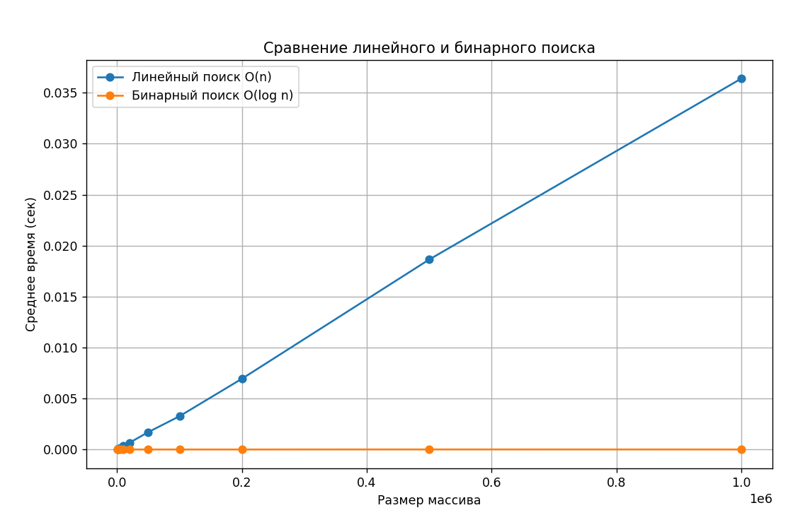
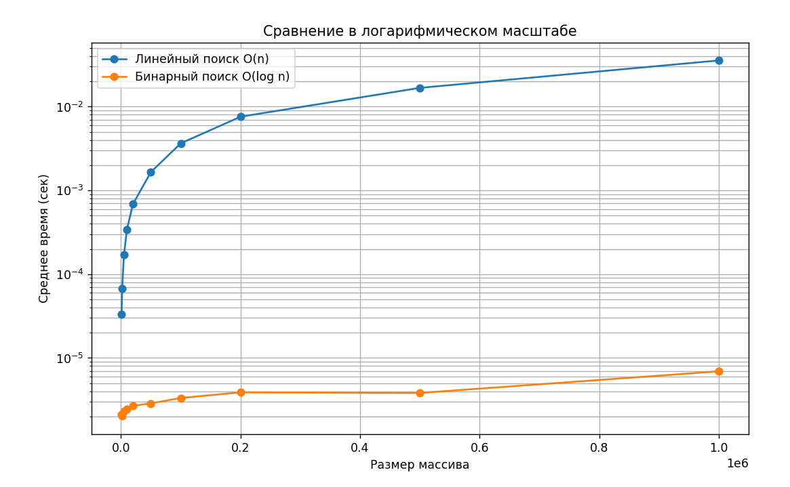

 # Тема 01: Введение в алгоритмы. Сложность. Поиск.
 ## Цель работы: 
 Освоить понятие вычислительной сложности алгоритма. Получить практические навыки
 реализации и анализа линейного и бинарного поиска. Научиться экспериментально подтверждать
 теоретические оценки сложности O(n) и O(log n)
## Задание:
 1. Реализовать функцию линейного поиска элемента в массиве.
 2. Реализовать функцию бинарного поиска элемента в отсортированном массиве.
 3. Провести теоретический анализ сложности обоих алгоритмов.
 4. Экспериментально сравнить время выполнения алгоритмов на массивах разного размера.
 5. Визуализировать результаты, подтвердив асимптотику O(n) и O(log n)
## Шаги выполнения
 ### Реализация алгоритмов:
 - Реализовать функцию linear_search(arr, target).
```python
def linear_search(arr, target):
    # O(n) - в худшем случае проверим все элементы
    for i in range(len(arr)):  # O(n)
        if arr[i] == target:  # O(1)
            return i  # O(1)
    return -1  # O(1)
# Общая сложность: O(n)
```
 - Реализовать функцию binary_search(arr, target).
```python
def binary_search(arr, target):
    left, right = 0, len(arr) - 1  # O(1)
    while left <= right:  # O(log n)
        mid = (left + right) // 2  # O(1)
        if arr[mid] == target:  # O(1)
            return mid  # O(1)
        elif arr[mid] < target:  # O(1)
            left = mid + 1  # O(1)
        else:
            right = mid - 1  # O(1)
    return -1  # O(1)
# Общая сложность: O(log n)
```
### 3. Подготовка данных: 
Сгенерировать отсортированные массивы целых чисел разного размера
 (напр., [1000, 2000, 5000, ..., 1000000]). Для каждого размера выбрать целевой элемент
 (напр., первый, последний, средний, отсутствующий).
```python
def main():
    sizes = [1000, 2000, 5000, 10000, 20000, 50000, 100000, 200000, 500000, 1000000]
    linear_times = []
    binary_times = []

    for size in sizes:
        arr = list(range(size))  # отсортированный массив
        targets = [arr[0], arr[size // 2], arr[-1], -1]  # первый, середина, последний, отсутствующий
```
### 4. Эмпирический анализ производительности:
 - Написать функцию для замера среднего времени выполнения.
 - Для каждого размера массива и каждого алгоритма провести серию замеров времени
 поиска
```python
 def measure_time(func, arr, target, repeats=5):  # O(1)
    start = time.perf_counter()  # O(1)
    for _ in range(repeats):  # O(repeats)
        func(arr, target)  # O(T(n)) — зависит от алгоритма (O(n) или O(log n))
    end = time.perf_counter()  # O(1)
    return (end - start) / repeats  # O(1)
# Общая сложность: O(repeats * T(n)), где T(n) — сложность алгоритма поиск

# замер линейного поиска
    total_linear = 0
    for t in targets:
        total_linear += measure_time(linear_search, arr, t)
    linear_times.append(total_linear / len(targets))

        # замер бинарного поиска
    total_binary = 0
    for t in targets:
        total_binary += measure_time(binary_search, arr, t)
    binary_times.append(total_binary / len(targets))
```
 ### 5. Визуализация:
 - Построить на одном графике зависимости времени выполнения от размера массива для
 обоих алгоритмов.
 - Построить второй график в логарифмическом масштабе по оси y (для наглядного
 отображения O(log n)) или по обеим осям (log-log scale).


### 6. Анализ и объяснение расхождений между теорией и практикой  

#### 1. Теоретические ожидания  

-  **Линейный поиск**: сложность `O(n)`. Время должно расти пропорционально размеру массива: чем больше элементов, тем дольше выполняется поиск.  

-  **Бинарный поиск**: сложность `O(log n)`. Время работы увеличивается очень медленно: например, при росте массива в 1000 раз количество шагов возрастает всего с ~10 до ~20.  

---

#### 2. Практические результаты  

-  **Линейный поиск**: полученные данные показали почти идеальную линейную зависимость.  
   Например:  
  Размер: 1000  → 0.000034 c  
  Размер: 10000 → 0.000336 c (примерно в 10 раз больше)  
  Размер: 1000000 → 0.036392 c (примерно в 1000 раз больше, чем при 1000).  
  Это полностью подтверждает теоретическую сложность `O(n)`.  

-  **Бинарный поиск**: время поиска остаётся почти постоянным — от `0.000002` до `0.000009` секунд,  
   несмотря на то, что размер массива увеличился с 1000 до 1 000 000.  
   Это подтверждает логарифмическую сложность `O(log n)`: даже при миллионных массивах количество шагов остаётся очень небольшим (около 20).  

---

#### 3. Причины расхождений  

-  Для бинарного поиска измеренное время кажется «плоским» (почти не растёт), потому что Python выполняет такие операции очень быстро, и разница в миллисекундах слишком мала для стандартного таймера.  
-  В линейном поиске рост времени фиксируется гораздо заметнее, потому что при увеличении массива программа действительно делает всё больше и больше проверок.  
секунд.
