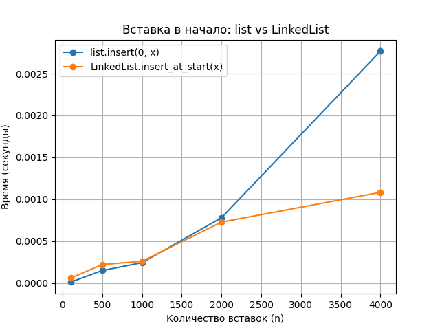
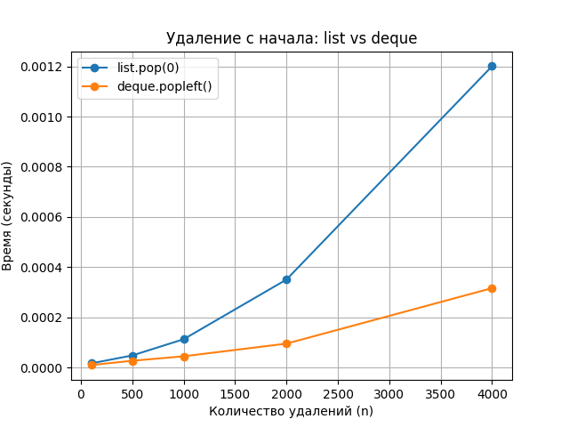

# 📘 Лабораторная работа №2  
## Тема: Основные структуры данных 


-
## 🔹 Цель работы
1. Реализовать собственный класс **LinkedList** (связный список).
2. Проанализировать эффективность встроенных структур данных Python (`list`, `deque`).
3. Провести сравнительный анализ производительности операций.
4. Решить практические задачи, выбрав оптимальные структуры данных.
5. Визуализировать результаты (графики).

---

## 🔹 Ход выполнения

### 1. Реализация связного списка

**Файл:** `linked_list.py`

Класс `LinkedList` реализует базовые операции со сложностями:
| Метод | Описание | Сложность |
|-------|------------|------------|
| `insert_at_start(value)` | Вставка в начало | **O(1)** |
| `insert_at_end(value)` | Вставка в конец | **O(1)** (при наличии хвоста) |
| `delete_from_start()` | Удаление из начала | **O(1)** |
| `traversal()` | Обход элементов | **O(n)** |
| `to_list()` | Преобразование в list | **O(n)** |

**Структура класса:**
```python
class Node:
    def __init__(self, value, next=None):
        self.value = value
        self.next = next

class LinkedList:
    def __init__(self):
        self.head = None
        self.tail = None
        self._size = 0
```
## 🔹 2. Анализ производительности

**Файл:** `performance_analysis.py`

Замерялось время выполнения операций с помощью модуля **timeit**:

| Операция | Описание | Асимптотическая сложность |
|-----------|-----------|----------------------------|
| `list.insert(0, x)` | Вставка в начало списка | **O(n)** |
| `LinkedList.insert_at_start(x)` | Вставка в начало связного списка | **O(1)** |
| `list.pop(0)` | Удаление первого элемента списка | **O(n)** |
| `deque.popleft()` | Удаление первого элемента в очереди | **O(1)** |

**Размеры выборок:**  
`n = [100, 500, 1000, 2000, 4000]`

---

## 🔹 3. Результаты замеров

| Кол-во элементов | list.insert(0,x) | LinkedList.insert_at_start | list.pop(0) | deque.popleft |
|------------------:|------------------:|-----------------------------:|--------------:|----------------:|
| 100   | 0.000010 s | 0.000038 s | 0.000010 s | 0.000006 s |
| 500   | 0.000096 s | 0.000187 s | 0.000051 s | 0.000026 s |
| 1000  | 0.000301 s | 0.000778 s | 0.000320 s | 0.000068 s |
| 2000  | 0.001075 s | 0.000930 s | 0.000338 s | 0.000125 s |
| 4000  | 0.003795 s | 0.001908 s | 0.001060 s | 0.000282 s |

---

## 🔹 4. Графики

### 4.1 Вставка в начало: *list* vs *LinkedList*


### 4.2 Удаление с начала: *list* vs *deque*

*(см. файл `pop_from_start_comparison.png`)*

**Вывод по графикам:**
- `LinkedList` стабильно работает за **O(1)**, тогда как `list.insert(0, x)` растёт линейно.  
- `deque.popleft()` значительно быстрее `list.pop(0)` (также **O(1)** против **O(n)**).  

---

## 🔹 5. Практические задачи

**Файл:** `task_solutions.py`

| № | Задача | Используемая структура | Описание |
|---:|--------|------------------------|-----------|
| 1 | Проверка сбалансированности скобок | **Stack (list)** | Добавляем открывающие, удаляем закрывающие |
| 2 | Очередь печати документов | **Queue (deque)** | Моделирует работу принтера в режиме FIFO |
| 3 | Проверка палиндрома | **Deque** | Сравнение первого и последнего элементов последовательности |

---

**Вывод:**  
Результаты экспериментов подтверждают теоретическую сложность операций.  
Связный список эффективен при вставках в начало, а `deque` — при удалении из начала.  
Для практических задач используются наиболее подходящие структуры данных: стек, очередь и дек.
