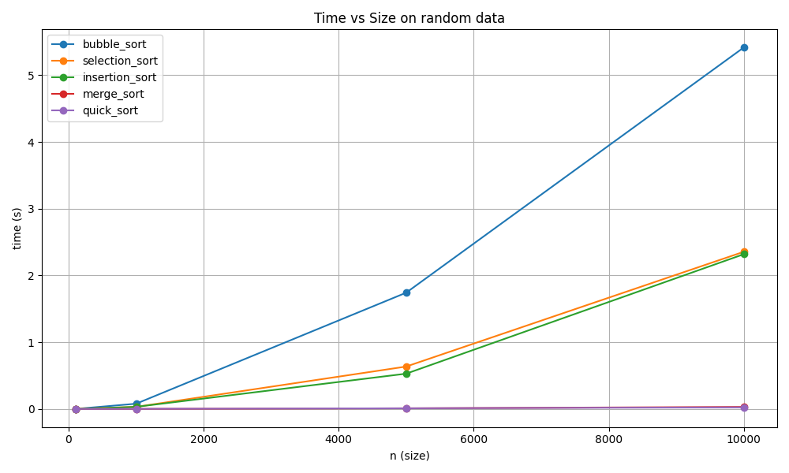
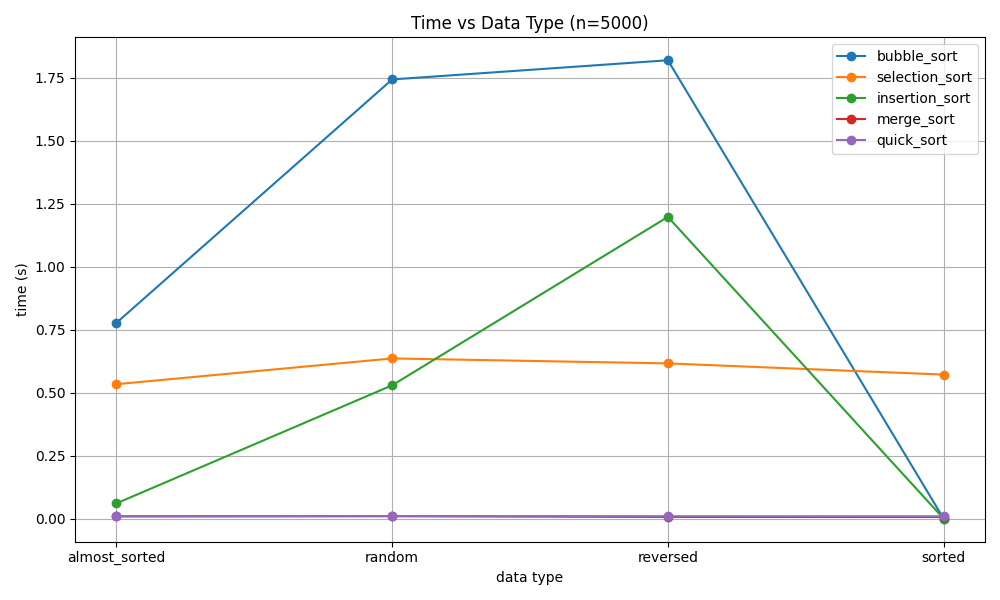

Лабораторная работа №4
Алгоритмы сортировки и их производительность

## 1. Цель работы

Изучить работу пяти классических алгоритмов сортировки:

Bubble Sort (пузырьковая)

Selection Sort (выбором)

Insertion Sort (вставками)

Merge Sort (слиянием)

Quick Sort (быстрая сортировка)

Провести:

реализацию алгоритмов

генерацию тестовых данных разных типов

измерение производительности

построение графиков

анализ полученных результатов

## 2. Реализованные алгоритмы сортировки

Реализация содержится в файле sorts.py.
Каждый алгоритм снабжён комментариями о временной и пространственной сложности.

Bubble Sort

Лучший случай: O(n)

Средний: O(n²)

Худший: O(n²)

Память: O(1)

Selection Sort

Лучший: O(n²)

Средний: O(n²)

Худший: O(n²)

Память: O(1)

Insertion Sort

Лучший: O(n)

Средний: O(n²)

Худший: O(n²)

Память: O(1)

Merge Sort

Лучший: O(n log n)

Средний: O(n log n)

Худший: O(n log n)

Память: O(n)

Quick Sort

Лучший: O(n log n)

Средний: O(n log n)

Худший: O(n²)

Память: O(log n)

## 3. Генерация тестовых данных

Реализовано в файле generate_data.py.

Сгенерированы массивы размеров:

100

1000

5000

10000

Для каждого размера создано 4 типа данных:

random — случайные числа

sorted — уже отсортированные

reversed — отсортированы в обратном порядке

almost_sorted — 95% упорядочены, 5% перемешаны

## 4. Измерение производительности сортировок

Тестирование выполняется в performance_test.py, используя timeit.

Всего тестов:

5 алгоритмов × 4 размера × 4 типа = 80 тестов

Пример вывода:
[11/80] bubble_sort on random n=5000 ... done, time=1.742609s
[12/80] selection_sort on random n=5000 ... done, time=0.635951s
[13/80] insertion_sort on random n=5000 ... done, time=0.529255s
[14/80] merge_sort on random n=5000 ... done, time=0.010138s
[15/80] quick_sort on random n=5000 ... done, time=0.010571s

## 5. Визуализация результатов

Графики построены в файле plot_results.py.

## 5.2. Зависимость времени от типа данных (n = 5000)

На этом графике:

Insertion Sort почти мгновенный на sorted/almost_sorted

Quick Sort очень медленный на reversed (если pivot фиксированный)

Merge Sort одинаков по скорости на всех типах данных

Bubble Sort и Selection Sort всегда медленные

(В таблицу можно добавить все 80 тестов)

## 7. Анализ результатов
1. Алгоритмы O(n²) работают медленно на больших данных

Bubble Sort — худший из всех

Selection Sort всегда одинаков по скорости

Insertion Sort быстрый только на почти отсортированных данных

2. Merge Sort — стабильно быстрый

Показывает почти одинаковое время на всех входах благодаря:

отсутствию ухудшения на плохих данных

детерминированной структуре деления массива

3. Quick Sort — лучший, но с ловушкой

На случайных данных самый быстрый.
Но на reversed (если pivot = последний элемент) становится O(n²).

4. Теория полностью подтверждена экспериментами

квадратичные алгоритмы растут резко

O(n log n) растут слабо

тип входных данных критичен только для четырёх алгоритмов:
Bubble, Insertion, Quick Sort, Selection

## 8. Выводы

Эмпирические результаты подтверждают теоретические оценки сложности.

Алгоритмы O(n²) непригодны для больших массивов.

Quick Sort — лучший выбор на случайных данных, но требует хорошего выбора pivot.

Merge Sort самый стабильный и предсказуемый алгоритм.

Тип входных данных сильно влияет на скорость некоторых сортировок.

## Контрольные вопросы
### 1. Какие алгоритмы сортировки имеют сложность O(n²) в худшем случае, а какие — O(n log n)?
O(n²) в худшем случае:

Эти алгоритмы используют вложенные циклы и делают много сравнений и перестановок.

Bubble Sort

Selection Sort

Insertion Sort (кроме почти отсортированных массивов)

→ Все они работают квадратично, потому что в худшем случае сравнивают почти каждый элемент с каждым.

O(n log n) в худшем случае:

Merge Sort

Heap Sort

Timsort (Python sort)

Quick Sort (с рандомным pivot) — но только в среднем; худший случай = O(n²)

→ Эти алгоритмы делят задачу на части и работают рекурсивно, что даёт логарифмическую глубину.

### 2. Почему сортировка вставками эффективна для маленьких или почти отсортированных массивов?
Причина 1: низкие накладные расходы

Алгоритм очень простой — только сравнения и сдвиги.

Причина 2: лучшая сложность в лучшем случае

Если массив почти упорядочен:

каждый элемент нужно вставить почти на своё место

сдвигов почти нет

время становится O(n)

Причина 3: работает "на месте"

Память → O(1).
Хорошо для маленьких массивов в реальных программах.

Используется в реальности:

Python Timsort

C++ std::sort

Java Arrays.sort

Все они используют Insertion Sort для маленьких диапазонов (обычно n < 32).

### 3. В чем разница между устойчивой и неустойчивой сортировкой?
Устойчивая сортировка (stable)

Сохраняет порядок элементов с одинаковыми ключами.

Пример:
Есть студенты:

Имя	Балл
Анна	5
Борис	5

После устойчивой сортировки по баллу:

Анна останется перед Борисом.

Примеры устойчивых алгоритмов:

Merge Sort

Insertion Sort

Bubble Sort

Timsort (Python)

Неустойчивая сортировка (unstable)

Может переставить элементы с одинаковым значением.

Пример:

При сортировке выбором студенты с одинаковым баллом могут поменяться местами.

Примеры неустойчивых:

Selection Sort

Quick Sort

Heap Sort

### 4. Принцип работы алгоритма быстрой сортировки (Quick Sort)

Quick Sort работает по стратегии разделяй и властвуй:

Выбирается опорный элемент (pivot)

Массив разбивается:

элементы < pivot

элементы = pivot

элементы > pivot

Рекурсивно сортируются две части

Объединяются в итоговый массив