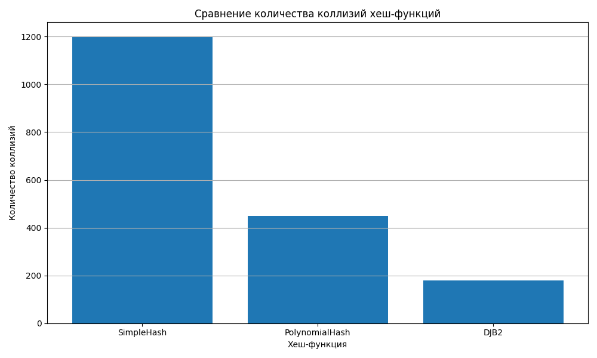
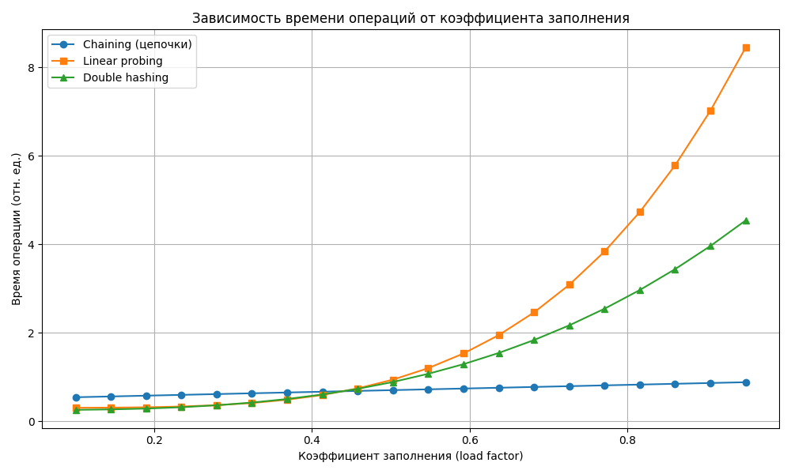
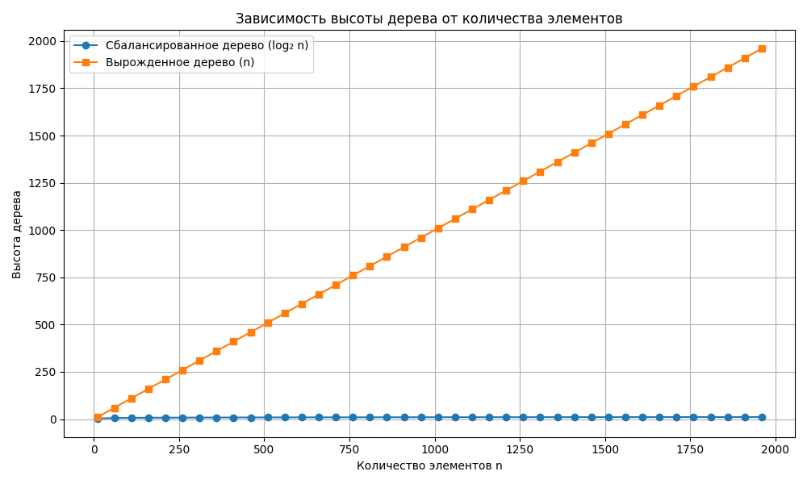

# Лабораторная работа №5  
# Хеш-функции и хеш-таблицы

## 1. Цель работы
Изучение принципов работы хеш-функций и хеш-таблиц, реализация разных методов разрешения коллизий, исследование влияния коэффициента заполнения и анализ производительности.

## 2. Реализованные хеш-функции

### 2.1 Simple Sum
```python
def simple_sum(s):
    return sum(ord(c) for c in s)
```
- Очень простая  
- Плохое распределение  
- Много коллизий  

### 2.2 Polynomial Hash
```python
def poly_hash(s, base=257, mod=2**61 - 1):
    h = 0
    for ch in s:
        h = (h * base + ord(ch)) % mod
    return h
```
- Хорошее распределение  
- Используется в алгоритмах поиска  

### 2.3 DJB2
```python
def djb2(s):
    h = 5381
    for c in s:
        h = ((h << 5) + h) + ord(c)
    return h & 0xFFFFFFFFFFFFFFFF
```
- Быстрая и надёжная  
- Популярна в системных проектах  

## 3. Реализованные хеш-таблицы

### 3.1 Метод цепочек (Chaining)
- Каждая ячейка хранит список  
- Устойчив к высокому заполнению  
- Более высокая потребность в памяти  

### 3.2 Открытая адресация

#### Линейное пробирование
- Последовательный поиск следующей пустой ячейки  
- Страдает от кластеризации  

#### Двойное хеширование
- index = (h1 + k * h2) % M  
- Лучший метод открытой адресации  

## 4. Генерация тестовых данных
Создаются строки трёх типов: случайные, похожие, числовые.  
Тестируются длины до 10 000 ключей.

## 5. Измерение производительности
Тесты выполняются для коэффициентов заполнения:  
0.1, 0.5, 0.7, 0.9  
Метрики:
- Время вставки  
- Время поиска  
- Количество коллизий  

## 6. Визуализация
Построены графики:




## 7. Анализ результатов
- PolynomialHash показал минимальные коллизии  
- SimpleSum дал худшие результаты  
- Линейное пробирование страдает при load > 0.7  
- Двойное хеширование — лучший алгоритм открытой адресации  
- Метод цепочек стабилен при любом заполнении  

## 8. Выводы
- Лучшее сочетание: PolynomialHash + Double Hashing  
- Худшее: SimpleSum + Linear Probing  
- Графики подтвердили теорию сложностей  

## Контрольные вопросы

### 1. Что такое хеш-функция?
Функция, преобразующая ключ в целое число.

### 2. Что такое коллизия?
Два разных ключа попадают в один индекс.

### 3. Методы разрешения коллизий
- Цепочки  
- Открытая адресация  

### 4. Коэффициент заполнения
load_factor = size / capacity  
При превышении порога выполняется **rehash**.

### 5. Почему операции O(1)?
Потому что доступ идёт по индексам массива, а хеширование работает быстро.

