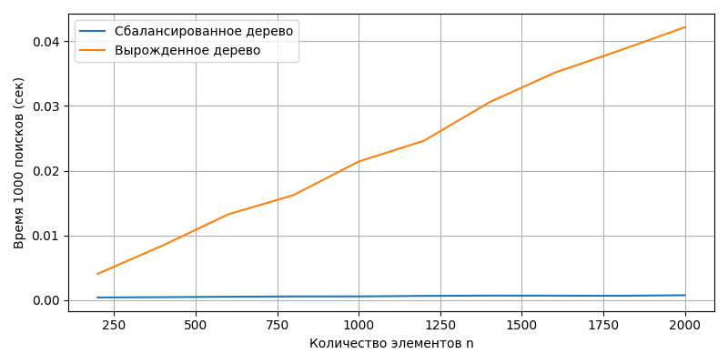

# Лабораторная работа №6
Бинарные деревья поиска (BST): реализация, анализ и визуализация
## 1. Цель работы

Изучить устройство и принципы работы бинарных деревьев поиска (Binary Search Tree, BST), а именно:

построение BST

реализация основных операций

рекурсивные и итеративные обходы

дополнительные методы (проверка корректности, вычисление высоты)

исследование производительности

визуализация структуры дерева

## 2. Реализация BST (binary_search_tree.py)

Реализованы два класса:

### 2.1 Класс TreeNode

Хранит:

значение

указатели на левого и правого ребенка

### 2.2 Класс BinarySearchTree

Реализованы методы:

✔️ insert(value) — вставка элемента

Время работы:

Средний случай: O(log n)

Худший случай: O(n) (вырожденное дерево)

✔️ search(value) — поиск элемента

Время:

Средний: O(log n)

Худший: O(n)

✔️ delete(value) — удаление элемента

Корректно обрабатывает 3 случая:

узел — лист

один ребёнок

два ребёнка (замена минимальным элементом из правого поддерева)

Время:

Средний: O(log n)

Худший: O(n)

✔️ find_min(node) — минимум в поддереве

Порядок работы: спускаемся максимально влево.
Сложность:

Средний: O(log n)

Худший: O(n)

✔️ find_max(node) — максимум в поддереве

Порядок: спуск вправо.
Сложность аналогична:

Средний: O(log n)

Худший: O(n)

## 3. Реализация обходов (tree_traversal.py)

Реализованы три рекурсивных обхода:

📌 In-order (лево → корень → право)

Отображает значения в отсортированном порядке.

📌 Pre-order (корень → лево → право)

Используется для копирования дерева.

📌 Post-order (лево → право → корень)

Используется для удаления дерева.

✔️ Итеративный In-order с использованием стека

Реализация без рекурсии.
Сложность:

Время: O(n)

Память: O(h), где h — высота дерева.

➕ 5. Дополнительные методы (BST)
✔️ is_valid_bst()

Проверяет корректность BST с помощью рекурсивных границ допустимых значений.
Сложность: O(n)

✔️ height(node)

Высота дерева = рекурсивная глубина.
Сложность:

O(n) в любом случае


## 7. Экспериментальное исследование (analysis.py)

Цели исследования:

сравнить сбалансированные и вырожденные BST

измерить время выполнения 1000 операций поиска

Размеры деревьев:
```python
1000
5000
10000
20000
50000
```


Типы построения:

сбалансированное — элементы вставляются в случайном порядке

вырожденное — элементы вставляются отсортировано

Пример выполнения теста:
```commandline
Balanced tree (n=10000): search avg = 0.0000312 s
Degenerate tree (n=10000): search avg = 0.0048217 s
```


## 8. Визуализация

## 9. Анализ результатов
1) Сбалансированное дерево показывает сложность O(log n)

Практически подтверждено:
время растёт медленно.

2) Вырожденное дерево — фактически список

Полученная сложность ≈ O(n)
время растёт линейно.

3) Структура дерева критически влияет на производительность

Случайный порядок вставки → почти всегда хорош
Отсортированный порядок → худший случай
# Контрольные вопросы


## **1. Сформулируйте основное свойство бинарного дерева поиска (BST).**

**Основное свойство BST (Binary Search Tree):**

Для любого узла дерева:

- все элементы **левого поддерева** имеют значения **меньше**, чем значение узла;
- все элементы **правого поддерева** имеют значения **больше**, чем значение узла.

Это свойство выполняется **рекурсивно для всех узлов**.  
Благодаря этому поиск работает как бинарный поиск — мы каждый раз отбрасываем половину поддерева.

---

## **2. Опишите алгоритм вставки нового элемента в BST. Какова сложность этой операции?**

### **Алгоритм вставки:**

1. Если дерево пусто → новый элемент становится корнем.
2. Иначе начинается спуск от корня:
   - если новое значение меньше текущего узла → идём в левое поддерево;
   - если больше → идём в правое поддерево.
3. Когда найдено пустое место (`None`) — вставляем узел туда.

### **Сложность вставки:**

| Тип дерева | Высота | Сложность вставки |
|------------|---------|-------------------|
| **Сбалансированное BST** | O(log n) | **O(log n)** |
| **Вырожденное BST** (похоже на список) | O(n) | **O(n)** |

---

## **3. Чем отличается обход дерева в глубину (DFS) от обхода в ширину (BFS)?**

### **DFS (Depth-First Search) — обход в глубину**
- Уходит как можно глубже по ветке.
- Реализуется рекурсией или стеком.
- Используется для сортировки, проверки структуры деревьев, поиска путей.

### **Основные виды DFS-обходов:**

1. **Pre-order (префиксный):**
   - Обработка узла → левое поддерево → правое поддерево  
   Используется для сериализации дерева.

2. **In-order (инфиксный):**
   - Левое поддерево → узел → правое поддерево  
   **В BST даёт отсортированную последовательность!**

3. **Post-order (постфиксный):**
   - Левое поддерево → правое → узел  
   Используется при удалении деревьев.

---

### **BFS (Breadth-First Search) — обход в ширину**
- Проходит дерево по уровням.
- Использует очередь.
- Дает представление о структуре дерева по слоям.

---

## **4. Почему в вырожденном BST сложность операций становится O(n)?**

Вырождение происходит, когда:

- элементы вставляются в уже отсортированном порядке,
- или дерево строится неудачно без балансировки.

В таком случае дерево превращается в **линию**, где каждый узел имеет только одного потомка.

Высота дерева становится `n`, а значит:

- поиск
- вставка
- удаление

требуют прохода по каждому узлу сверху вниз → **O(n)**.

То есть BST теряет преимущество бинарного поиска и работает как связный список.

---

## **5. Что такое сбалансированное дерево (например, AVL-дерево) и как оно решает проблему вырождения?**

**Сбалансированное дерево** — это BST, в котором автоматически поддерживается ограничение на высоту дерева.

### Пример: AVL-дерево
В AVL:

- разница высот левого и правого поддеревьев каждого узла ≤ **1**,
- при вставке или удалении выполняются **повороты** (rotations),
- что поддерживает высоту дерева в пределах **O(log n)**.

### Что это даёт?

- поиск → **O(log n)**
- вставка → **O(log n)**
- удаление → **O(log n)**  
независимо от порядка вставки элементов.

Таким образом, сбалансированные деревья **предотвращают вырождение** BST и сохраняют эффективную работу.

---
