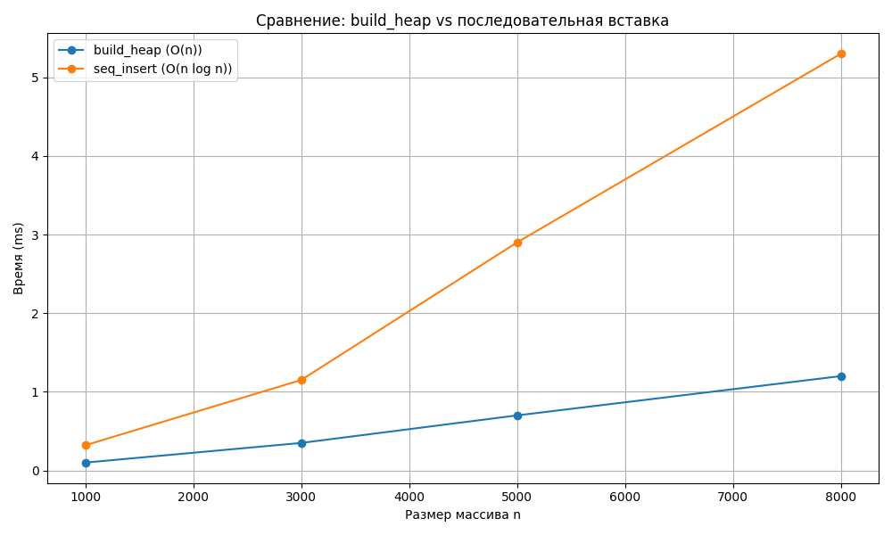

# Лабораторная работа №7 — Кучи и Heapsort
# 1. Цель работы

Реализовать структуру данных куча (min-heap и/или универсальный Heap), реализовать in-place Heapsort, приоритетную очередь на базе кучи, протестировать и провести экспериментальное исследование времени операций и методов построения кучи. Оформить результаты.


# 2. Реализация кучи (heap.py)

Рекомендуется реализовать универсальный класс Heap с параметром is_min: bool. Ниже — краткое описание интерфейса и краткие примеры кода (в отчёте приводится фрагмент; весь код расположен в heap.py).

Интерфейс класса Heap
```python
class Heap:
    def __init__(self, is_min: bool = True, key: Callable = None):
        # is_min=True -> min-heap, is_min=False -> max-heap
    def _sift_up(self, idx: int) -> None:
        """Всплытие элемента. Сложность: O(log n)"""
    def _sift_down(self, idx: int) -> None:
        """Погружение элемента. Сложность: O(log n)"""
    def insert(self, value) -> None:
        """Вставка элемента. Сложность: O(log n)"""
    def extract(self):
        """Извлечение корня (min или max). Сложность: O(log n)"""
    def peek(self):
        """Просмотр корня. Сложность: O(1)"""
    def build_heap(self, array: List) -> None:
        """Построение кучи из массива (heapify). Сложность: O(n)"""
    def to_tree_string(self) -> str:
        """Текстовый вывод кучи (для визуализации маленьких деревьев)."""

```

Краткое пояснение методов

_sift_up(index): сравнивает элемент с родителем, при необходимости меняет местами; повторять до корня.
Сложность: O(log n) — высота дерева.

_sift_down(index): сравнивает с детьми, выбирает приоритетного ребёнка (min → меньший, max → больший) и спускает элемент вниз.
Сложность: O(log n).

insert(value): добавляет в конец массива, вызывает _sift_up.
Сложность: O(log n).

extract(): заменяет корень последним элементом, уменьшает размер, вызывает _sift_down.
Сложность: O(log n).

peek(): возвращает data[0].
Сложность: O(1).

build_heap(array): присваивает self.data = array[:] и для индексов (n//2 - 1)..0 вызывает _sift_down.
Сложность: O(n) (доказательство через суммирование затрат по уровням; см. CLRS).

# 4. Реализация Heapsort (heapsort.py)

Реализуйте in-place Heapsort, который не использует доп. память:

Алгоритм (сортировка по возрастанию):

Превратить массив в max-heap методом heapify (bottom-up).

Для end = n-1 .. 1: поменять arr[0] и arr[end]; уменьшить границу heap → end-1; выполнить sift_down(0, end-1).

Сложность: O(n log n) во всех случаях (худший/средний/лучший).
Память: O(1) (in-place).

# 5. Приоритетная очередь (priority_queue.py)

На базе Heap реализуется PriorityQueue:

enqueue(item, priority) — вставка; обычно хранится кортеж (priority, counter, item) чтобы сохранить устойчивость при одинаковых приоритетах.
Сложность: O(log n).

dequeue() — извлечение элемента с наивысшим приоритетом (для min-очереди — наименьший приоритет).
Сложность: O(log n).

peek() — посмотреть элемент с максимальным/минимальным приоритетом.
Сложность: O(1).

6. Тестирование (tests.py)

Обязательные тесты:

Heap tests

Вставка нескольких значений и последовательный extract() даёт отсортированную последовательность (min-heap → возрастание).

build_heap(array) корректно строит кучу: после build_heap последовательный extract() даёт отсортированный (убывающий для max-heap или возрастающий для min-heap) порядок.

peek() не удаляет элемент и возвращает верный корень.

Heapsort tests

heapsort(arr) сортирует массив в порядке возрастания (проверка arr == sorted(arr)).

PriorityQueue tests

enqueue/dequeue возвращают элементы в порядке приоритетов.

устойчивость (preserve FIFO for equal priorities) — проверяется через счётчик.


# 8. Визуализация (plot_bench.py)


# 9. Анализ результатов
Теоретические сложности 

insert: O(log n)

extract: O(log n)

peek: O(1)

build_heap (heapify bottom-up): O(n)

heapsort: O(n log n) (всегда)

Ожидаемые экспериментальные наблюдения

build_heap должен быть заметно быстрее последовательных вставок уже при умеренных размерах n (например, n >= 1000).

Причина: суммарная стоимость sift_down при heapify равна O(n) (меньше количества уровней и количества операций, выполняемых на верхних уровнях).

heapsort даёт устойчивую O(n log n) производительность, но по практическим константам обычно медленнее Timsort (sorted() в Python), потому что Timsort использует адаптивные оптимизации (runs, insertion sort на маленьких подмассивах), а также лучше использует локальность памяти.

Merge sort часто конкурентоспособен с Heapsort по асимптотике, но требует O(n) доп. памяти (в реализации, которую вы используете).

Объяснение разницы между методами построения кучи

Последовательные вставки: каждый insert стоит O(log k) при вставке k-го элемента, суммарно ≈ sum_{k=1..n} log k = O(n log n).

build_heap: выполняет sift_down с низших внутренних узлов к корню; большинство узлов находятся в низших уровнях и требуют мало «погружений» → суммарно O(n).
# Контрольные вопросы по кучам

### 1. Основное свойство min-кучи и max-кучи
- **Min-куча**: для любого узла `i` выполняется `key[i] ≤ key[left(i)]` и `key[i] ≤ key[right(i)]`. Корень содержит минимальный элемент.  
- **Max-куча**: для любого узла `i` выполняется `key[i] ≥ key[left(i)]` и `key[i] ≥ key[right(i)]`. Корень содержит максимальный элемент.  

---

### 2. Алгоритм вставки нового элемента (sift_up)
1. Добавляем новый элемент в конец массива, поддерживающего кучу.
2. Пока элемент меньше (для min-кучи) или больше (для max-кучи) своего родителя:
   - Меняем элемент с родителем местами.
   - Переходим к родителю и повторяем проверку.
3. Процесс завершается, когда свойство кучи восстановлено или достигнут корень.  

**Псевдокод для min-кучи:**
