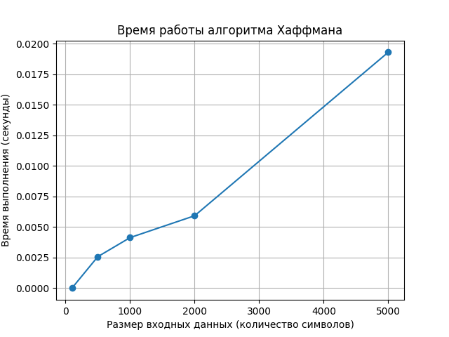

# Лабораторная работа №8 — Жадные алгоритмы

# 1. Цель работы

Изучить принципы работы жадных алгоритмов, реализовать классические жадные алгоритмы, проанализировать их корректность и эффективность, а также определить ограничения жадного подхода. Провести экспериментальное исследование времени работы одного из жадных алгоритмов и оформить результаты.

---

# 2. Теоретические сведения

Жадные алгоритмы — это класс алгоритмов, которые на каждом шаге делают локально оптимальный выбор, не рассматривая все возможные варианты решения задачи. Предполагается, что последовательность таких локальных решений приведёт к глобально оптимальному результату.

Жадный подход применим только к задачам, обладающим свойством жадного выбора, при котором существует оптимальное решение, начинающееся с локально оптимального шага. При отсутствии этого свойства жадный алгоритм может давать неоптимальные результаты.

Преимущества жадных алгоритмов:
- простота реализации;
- высокая скорость работы;
- низкие требования к памяти.

Недостатки:
- применимы не ко всем задачам;
- требуют строгого обоснования корректности;
- могут давать неправильные решения при неверном выборе стратегии.

---

# 3. Реализация жадных алгоритмов

## 3.1. Задача о выборе заявок (Interval Scheduling)

**Постановка задачи:**  
Дан набор временных интервалов, каждый из которых характеризуется временем начала и окончания. Требуется выбрать максимальное количество непересекающихся интервалов.

**Жадная стратегия:**  
На каждом шаге выбирается интервал с наименьшим временем окончания, который не пересекается с уже выбранными интервалами.

**Корректность:**  
Интервал, заканчивающийся раньше остальных, оставляет максимальное количество свободного времени для последующего выбора интервалов. Любое оптимальное решение можно преобразовать так, чтобы первым был выбран интервал с минимальным временем окончания, не ухудшая результат.

**Временная сложность:**  
O(n log n), где n — количество интервалов.

---

## 3.2. Непрерывный рюкзак (Fractional Knapsack)

**Постановка задачи:**  
Дан набор предметов с заданными весами и ценностями, а также рюкзак ограниченной вместимости. Разрешается брать дробные части предметов.

**Жадная стратегия:**  
Предметы сортируются по убыванию удельной стоимости (value / weight), после чего рюкзак заполняется наиболее выгодными предметами.

**Корректность:**  
Так как предметы можно делить, всегда выгоднее брать предмет с максимальной удельной стоимостью. Замена части менее выгодного предмета на более выгодный увеличивает общую ценность решения.

**Временная сложность:**  
O(n log n).

---

## 3.3. Алгоритм Хаффмана (Huffman Coding)

**Постановка задачи:**  
Для заданного множества символов и их частот требуется построить оптимальный префиксный код с минимальной средней длиной кодовых слов.

**Жадная стратегия:**  
На каждом шаге выбираются два символа с наименьшими частотами и объединяются в один узел дерева.

**Корректность:**  
В оптимальном префиксном коде два наименее частых символа всегда располагаются на максимальной глубине дерева и являются соседями. Их объединение минимизирует вклад в общую длину кодов.

**Временная сложность:**  
O(n log n).

---

# 4. Сравнительный анализ

Для задачи рюкзака был выполнен сравнительный анализ между жадным алгоритмом для непрерывной версии и точным алгоритмом решения задачи 0–1 рюкзака. Эксперимент показал, что жадный алгоритм не гарантирует оптимального решения для дискретной версии задачи, так как предметы нельзя дробить.

---

# 5. Экспериментальное исследование

Было проведено измерение времени работы алгоритма Хаффмана на входных данных различного размера. Результаты эксперимента показали рост времени выполнения, близкий к O(n log n), что соответствует теоретической оценке.

---

# 6. Анализ результатов

Жадные алгоритмы демонстрируют высокую эффективность и масштабируемость по сравнению с наивными методами. Однако их применение ограничено классом задач, для которых выполняется свойство жадного выбора.

---

# 7. Ограничения жадного подхода

- жадные алгоритмы не всегда дают оптимальное решение;
- требуется доказательство корректности для каждой задачи;
- не подходят для задач с глобальными зависимостями решений.

---

# 8. Выводы

В ходе лабораторной работы были изучены жадные алгоритмы и реализованы их классические примеры. Проведён анализ корректности и эффективности, а также экспериментальное исследование. Установлено, что жадный подход эффективен, но применим только к ограниченному классу задач.

---

# Контрольные вопросы

## 1. В чем заключается основная идея жадных алгоритмов?
Основная идея жадных алгоритмов заключается в том, что на каждом шаге выбирается локально оптимальное решение без учёта будущих последствий, при этом предполагается, что такая стратегия приведёт к глобально оптимальному результату.

## 2. Почему жадный алгоритм для Interval Scheduling является оптимальным?
Выбор интервала с минимальным временем окончания оставляет максимальное количество свободного времени для размещения последующих интервалов. Любое оптимальное решение можно преобразовать так, чтобы первым был выбран именно такой интервал.

## 3. Пример задачи, где жадный алгоритм работает, и где не работает
Жадный алгоритм даёт оптимальное решение в задаче непрерывного рюкзака.  
В задаче 0–1 рюкзака жадный алгоритм по удельной стоимости может давать неоптимальное решение.

## 4. Разница между непрерывным и дискретным рюкзаком
В непрерывной задаче рюкзака предметы можно брать дробными частями, поэтому жадный алгоритм является оптимальным. В дискретной (0–1) задаче предметы берутся целиком, и жадный подход не гарантирует оптимальности.

## 5. Жадный алгоритм Хаффмана и его оптимальность
Алгоритм Хаффмана на каждом шаге объединяет два символа с минимальной частотой. Его оптимальность заключается в минимизации суммарной длины кодов за счёт размещения редких символов на наибольшей глубине дерева.
