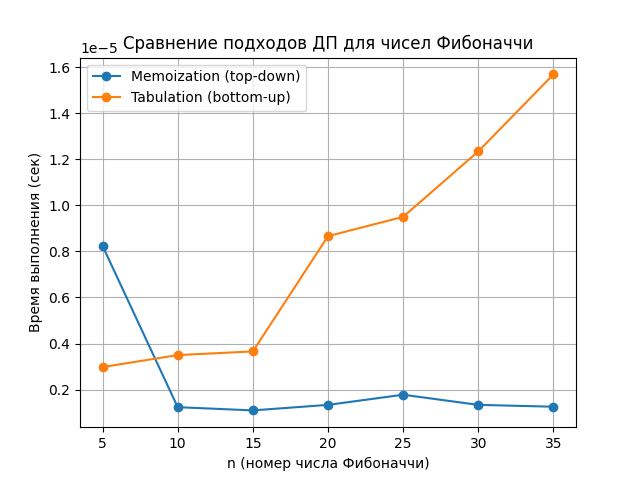

# Лабораторная работа №9 — Динамическое программирование

---

# 1. Цель работы

Изучить принципы динамического программирования, реализовать классические алгоритмы динамического программирования с использованием нисходящего и восходящего подходов, проанализировать их временную и пространственную сложность, а также провести экспериментальное исследование эффективности алгоритмов и визуализировать полученные результаты.

---

# 2. Теоретические сведения

Динамическое программирование — это метод решения задач, основанный на разбиении исходной задачи на набор перекрывающихся подзадач и сохранении результатов их решений для повторного использования. В отличие от жадных алгоритмов, динамическое программирование гарантирует нахождение оптимального решения за счёт полного учёта всех возможных вариантов.

Для применения динамического программирования задача должна обладать двумя ключевыми свойствами:

* **оптимальной подструктурой** — оптимальное решение задачи может быть получено из оптимальных решений её подзадач;
* **перекрывающимися подзадачами** — одни и те же подзадачи возникают многократно.

Основные подходы динамического программирования:

* **нисходящий (top-down)** — рекурсивное решение с мемоизацией;
* **восходящий (bottom-up)** — итеративное заполнение таблицы решений.

Преимущества динамического программирования:

* гарантированное нахождение оптимального решения;
* значительное уменьшение количества вычислений по сравнению с наивными методами;
* применимость к широкому классу задач оптимизации.

Недостатки:

* повышенные требования к памяти;
* сложность реализации по сравнению с жадными алгоритмами;
* не всегда очевидный способ формализации подзадач.

---

# 3. Реализация алгоритмов динамического программирования

## 3.1. Числа Фибоначчи

**Постановка задачи:**
Необходимо вычислить n-е число последовательности Фибоначчи, где каждое число равно сумме двух предыдущих.

**Реализованные подходы:**

* наивная рекурсия;
* нисходящий подход с мемоизацией;
* восходящий итеративный подход.

**Анализ:**
Наивная рекурсия приводит к экспоненциальному числу повторных вычислений. Использование динамического программирования позволяет сохранить промежуточные результаты и снизить сложность.

**Временная сложность:**

* наивная рекурсия — O(2ⁿ);
* мемоизация — O(n);
* табуляция — O(n).

---

## 3.2. Задача о рюкзаке (0–1 Knapsack)

**Постановка задачи:**
Дан набор предметов с весами и ценностями, а также рюкзак ограниченной вместимости. Каждый предмет можно взять не более одного раза. Требуется максимизировать суммарную ценность.

**Подход:**
Используется восходящее динамическое программирование с заполнением двумерной таблицы `dp[i][w]`, где хранится максимальная стоимость при использовании первых `i` предметов и вместимости `w`.

**Корректность:**
Оптимальное решение для `i` предметов строится на основе оптимальных решений для `i-1` предметов, что демонстрирует свойство оптимальной подструктуры.

**Временная сложность:**
O(nW)

---

## 3.3. Наибольшая общая подпоследовательность (LCS)

**Постановка задачи:**
Для двух строк требуется найти наибольшую общую подпоследовательность, сохраняющую порядок символов.

**Подход:**
Строится двумерная таблица `dp[i][j]`, где значение соответствует длине LCS для префиксов строк длины `i` и `j`.

**Корректность:**
Если текущие символы совпадают, длина LCS увеличивается на единицу, иначе выбирается максимум из двух предыдущих состояний.

**Временная сложность:**
O(nm)

---

## 3.4. Расстояние Левенштейна

**Постановка задачи:**
Определить минимальное количество операций вставки, удаления и замены для преобразования одной строки в другую.

**Подход:**
Восходящее динамическое программирование с заполнением таблицы `dp[i][j]`, содержащей минимальное количество операций для префиксов строк.

**Временная сложность:**
O(nm)

---

# 4. Восстановление решения

Для задач о рюкзаке и LCS реализовано восстановление оптимального решения путём обратного прохода по таблице динамического программирования. Это позволяет получить не только значение оптимума, но и конкретный набор предметов или саму подпоследовательность.

---

# 5. Решение практических задач

## 5.1. Задача «Размен монет»

С использованием динамического программирования была решена задача нахождения минимального количества монет для заданной суммы. Используется одномерный массив, где каждое значение хранит оптимальное решение для соответствующей суммы.

## 5.2. Наибольшая возрастающая подпоследовательность (LIS)

Реализован классический алгоритм динамического программирования с квадратичной сложностью, позволяющий определить длину LIS и восстановить саму подпоследовательность.

---

# 6. Экспериментальное исследование

Было проведено экспериментальное сравнение нисходящего и восходящего подходов на примере вычисления чисел Фибоначчи для различных значений `n`. Измерялось время выполнения алгоритмов на одной вычислительной машине. Также были собраны данные для построения графика зависимости времени выполнения от размера входных данных.

---

# 7. Визуализация и анализ результатов

По результатам эксперимента был построен график зависимости времени выполнения от параметра `n`. Эксперимент подтвердил линейную сложность алгоритмов динамического программирования и преимущество восходящего подхода по потреблению памяти.

---

# 8. Выводы

В ходе лабораторной работы были изучены основные принципы динамического программирования и реализованы его классические алгоритмы. Экспериментальное исследование подтвердило теоретические оценки сложности. Установлено, что динамическое программирование является мощным инструментом решения задач оптимизации, однако требует дополнительных затрат памяти и аккуратного проектирования решений.

---

# Контрольные вопросы

## 1. Какие два основных свойства задачи указывают на возможность применения динамического программирования?

Задача должна обладать свойством оптимальной подструктуры и содержать перекрывающиеся подзадачи, решения которых можно эффективно переиспользовать.

## 2. В чем разница между нисходящим и восходящим подходами?

Нисходящий подход использует рекурсию с мемоизацией и вычисляет подзадачи по мере необходимости. Восходящий подход заполняет таблицу решений итеративно, начиная с базовых случаев.

## 3. Как задача о рюкзаке 0–1 демонстрирует свойство оптимальной подструктуры?

Оптимальное решение для первых `i` предметов и заданной вместимости строится на основе оптимальных решений для первых `i-1` предметов.

## 4. Как строится таблица для задачи LCS?

Таблица `dp[i][j]` заполняется по строкам или столбцам, где каждая ячейка хранит длину LCS для префиксов строк длины `i` и `j`.

## 5. Как динамическое программирование снижает сложность вычисления чисел Фибоначчи?

За счёт сохранения уже вычисленных значений и устранения повторных вычислений сложность снижается с экспоненциальной до линейной, а при использовании матричного метода — до O(log n).

---

